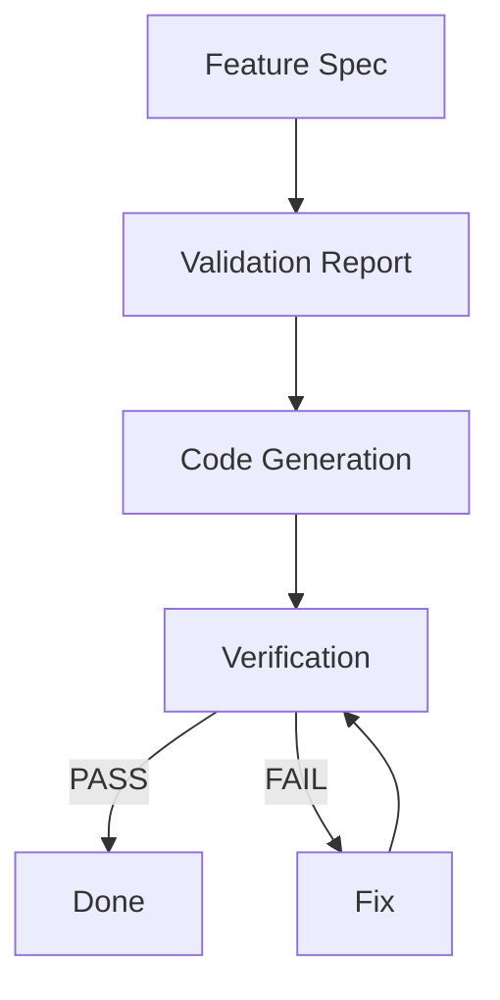

# GRACE: Generic Rule-based Architecture for Contracted Execution

Методология и набор инструментов для AI-assisted разработки с семантической разметкой кода, адаптированная для TrackHub (Java 17 + Spring Boot + Angular 17).

---

## 🎯 Что такое GRACE?

GRACE — это методология разработки, которая делает код понятным для AI-агентов через:

1. **Семантическую разметку** — каждый важный блок кода имеет ANCHOR и контракт
2. **AI-friendly логирование** — ENTRY/EXIT/BRANCH/DECISION/ERROR точки
3. **Контракты** — формальное описание предусловий, постусловий, инвариантов
4. **Многоуровневое тестирование** — детерминированные, траекторные, интеграционные тесты

---

## 🚀 Быстрый старт

### 1. Планирование фичи

Создайте Feature Specification в `plans/features/FEAT-XXX.md`:

```bash
# Пример: plans/features/FEAT-001-user-authentication.md
```

### 2. Валидация плана

Создайте Validation Report в `plans/validation/V-FEAT-XXX.xml`:

```bash
# Пример: plans/validation/V-FEAT-001-user-authentication.xml
```

### 3. Генерация кода

Сгенерируйте код с ANCHOR, контрактами и логированием:

- **Backend**: Java 17 + Spring Boot + SLF4J
- **Frontend**: Angular 17 + TypeScript + RxJS

### 4. Верификация

Запустите тесты и проверьте log-маркеры:

```bash
# Backend
mvn test

# Frontend
npm test
```

---

## 📁 Структура проекта

```
.kilocode/
├── rules/              # Правила методологии
│   ├── semantic-code-markup.md
│   ├── ai-logging.md
│   ├── semantic-graph-xml.md
│   ├── project_context.md
│   ├── error-patterns.md
│   └── semantic-markup-examples/
│       ├── example-java.java
│       ├── example-typescript.ts
│       ├── example-angular.ts
│       └── ...
├── semantic-graph.xml  # Архитектурный граф
└── GRACE.md           # Этот файл

plans/
├── features/           # Feature Specifications
│   └── FEAT-XXX.md
├── validation/         # Validation Reports
│   └── V-FEAT-XXX.xml
└── tasks.md           # Список задач

reports/
├── verification-*.md   # Verification Reports
└── fix-*.md           # Fix Reports
```

---

## 🤖 Агенты

| Агент | Режим | Назначение |
|-------|-------|------------|
| **implementer** | primary | Генерация кода по Feature Spec |
| **contract-reviewer** | subagent | Проверка соответствия контрактов |
| **verification-reviewer** | subagent | Прогон тестов и проверка маркеров |
| **fixer** | primary | Исправление багов с сохранением контрактов |

---

## 📝 Пример кода с разметкой

### Backend (Java 17 + Spring Boot)

```java
// [START_AUTH_LOGIN]
/*
 * ANCHOR: AUTH_LOGIN
 * PURPOSE: Аутентификация пользователя по email и паролю.
 *
 * @PreConditions:
 * - email: валидный email формат
 * - password: непустая строка
 *
 * @PostConditions:
 * - при успехе: возвращается AuthResponse с access_token и refresh_token
 * - при ошибке: выбрасывается AuthenticationException
 *
 * @Invariants:
 * - пароль никогда не возвращается в ответе
 * - токены всегда валидны при успешной аутентификации
 *
 * @SideEffects:
 * - создаёт refresh_token в БД
 * - логирует попытку входа
 *
 * @ForbiddenChanges:
 * - нельзя убрать rate limiting
 * - нельзя убрать валидацию пароля
 */
@Slf4j
@Service
public class AuthService {
    
    public AuthResponse login(String email, String password) {
        log.info("AUTH_LOGIN ENTRY - email: {}", email);
        
        // Rate limit check
        if (isRateLimited(email)) {
            log.warn("AUTH_LOGIN DECISION - rate_limited - email: {}", email);
            log.info("AUTH_LOGIN EXIT - rejected - reason: rate_limited");
            throw new AuthenticationException("Rate limit exceeded");
        }
        
        // Validate credentials
        User user = validateCredentials(email, password);
        log.debug("AUTH_LOGIN CHECK - credentials_valid - result: {}", user != null);
        
        if (user == null) {
            log.info("AUTH_LOGIN EXIT - rejected - reason: invalid_credentials");
            throw new AuthenticationException("Invalid credentials");
        }
        
        // Generate tokens
        String accessToken = jwtTokenProvider.generateAccessToken(user);
        String refreshToken = jwtTokenProvider.generateRefreshToken(user);
        
        log.info("AUTH_LOGIN EXIT - success - userId: {}", user.getId());
        
        return new AuthResponse(accessToken, refreshToken, mapToUserDto(user));
    }
}
// [END_AUTH_LOGIN]
```

### Frontend (Angular 17 + TypeScript)

```typescript
// [START_AUTH_LOGIN]
/*
 * ANCHOR: AUTH_LOGIN
 * PURPOSE: Аутентификация пользователя через API.
 *
 * @PreConditions:
 * - email: валидный email формат
 * - password: непустая строка
 * - пользователь не аутентифицирован
 *
 * @PostConditions:
 * - при успехе: токены сохранены в localStorage, пользователь перенаправлён на dashboard
 * - при ошибке: отображено сообщение об ошибке
 *
 * @Invariants:
 * - пароль никогда не сохраняется в localStorage
 * - токены всегда валидны при успешной аутентификации
 *
 * @SideEffects:
 * - сохраняет токены в localStorage
 * - обновляет состояние аутентификации
 * - перенаправляет пользователя
 *
 * @ForbiddenChanges:
 * - нельзя убрать обработку ошибок
 * - нельзя убрать сохранение токенов
 */
import { logLine } from '../core/lib/log';

@Injectable({ providedIn: 'root' })
export class AuthService {
  
  login(email: string, password: string): Observable<AuthResponse> {
    logLine('auth', 'DEBUG', 'login', 'AUTH_LOGIN', 'ENTRY', { email });
    
    return this.http.post<AuthResponse>('/api/auth/login', { email, password }).pipe(
      tap(response => {
        logLine('auth', 'DEBUG', 'login', 'AUTH_LOGIN', 'CHECK', {
          check: 'tokens_received',
          result: response.accessToken !== undefined
        });
        
        // Save tokens
        localStorage.setItem('access_token', response.accessToken);
        localStorage.setItem('refresh_token', response.refreshToken);
        
        logLine('auth', 'INFO', 'login', 'AUTH_LOGIN', 'STATE_CHANGE', {
          entity: 'auth_state',
          action: 'authenticated',
          userId: response.user.id
        });
        
        logLine('auth', 'DEBUG', 'login', 'AUTH_LOGIN', 'EXIT', { result: 'success' });
      }),
      catchError(error => {
        logLine('auth', 'ERROR', 'login', 'AUTH_LOGIN', 'ERROR', {
          reason: error.message,
          status: error.status
        });
        logLine('auth', 'DEBUG', 'login', 'AUTH_LOGIN', 'EXIT', { result: 'rejected' });
        return throwError(() => error);
      })
    );
  }
}
// [END_AUTH_LOGIN]
```

---

## 🧪 3 уровня тестирования

### Level 1: Детерминированные тесты

Проверка постусловий:

**Backend (JUnit 5):**
```java
@Test
void testLoginSuccess() {
    // Arrange
    String email = "user@example.com";
    String password = "password123";
    
    // Act
    AuthResponse response = authService.login(email, password);
    
    // Assert
    assertNotNull(response.getAccessToken());
    assertNotNull(response.getRefreshToken());
    assertNotNull(response.getUser());
}
```

**Frontend (Jasmine):**
```typescript
it('should login successfully', (done) => {
  authService.login('user@example.com', 'password123').subscribe(response => {
    expect(response.accessToken).toBeDefined();
    expect(response.refreshToken).toBeDefined();
    done();
  });
});
```

### Level 2: Тесты траектории

Проверка log-маркеров:

**Backend:**
```java
@Test
void testAuthLoginMarkers() {
    // Capture logs
    ListAppender<ILoggingEvent> appender = new ListAppender<>();
    appender.start();
    Logger logger = (Logger) LoggerFactory.getLogger(AuthService.class);
    logger.addAppender(appender);
    
    // Execute
    authService.login("user@example.com", "password");
    
    // Verify markers
    List<ILoggingEvent> logs = appender.list;
    assertTrue(logs.stream().anyMatch(l -> l.getMessage().contains("AUTH_LOGIN ENTRY")));
    assertTrue(logs.stream().anyMatch(l -> l.getMessage().contains("AUTH_LOGIN EXIT")));
}
```

**Frontend:**
```typescript
it('should log ENTRY and EXIT markers', (done) => {
  spyOn(logLine, 'logLine');
  
  authService.login('user@example.com', 'password123').subscribe(() => {
    expect(logLine).toHaveBeenCalledWith(
      'auth', 'DEBUG', 'login', 'AUTH_LOGIN', 'ENTRY', jasmine.any(Object)
    );
    expect(logLine).toHaveBeenCalledWith(
      'auth', 'DEBUG', 'login', 'AUTH_LOGIN', 'EXIT', jasmine.any(Object)
    );
    done();
  });
});
```

### Level 3: Интеграционные тесты

E2E сценарии:

**Backend (Spring Boot Test):**
```java
@SpringBootTest
@AutoConfigureMockMvc
class AuthIntegrationTest {
    
    @Autowired
    private MockMvc mockMvc;
    
    @Test
    void testE2E_LoginAndAccessProtectedEndpoint() throws Exception {
        // Login
        MvcResult loginResult = mockMvc.perform(post("/api/auth/login")
            .contentType(MediaType.APPLICATION_JSON)
            .content("{\"email\":\"user@example.com\",\"password\":\"password\"}"))
            .andExpect(status().isOk())
            .andReturn();
        
        String accessToken = JsonPath.read(loginResult.getResponse().getContentAsString(), "$.accessToken");
        
        // Access protected endpoint
        mockMvc.perform(get("/api/tracks")
            .header("Authorization", "Bearer " + accessToken))
            .andExpect(status().isOk());
    }
}
```

**Frontend (Cypress):**
```typescript
describe('E2E Login', () => {
  it('should login and access dashboard', () => {
    cy.visit('/login');
    cy.get('[data-cy="email-input"]').type('user@example.com');
    cy.get('[data-cy="password-input"]').type('password123');
    cy.get('[data-cy="login-button"]').click();
    
    cy.url().should('include', '/dashboard');
    cy.get('[data-cy="tracks-table"]').should('be.visible');
  });
});
```

---

## 📊 Workflow



---

## 📖 Документация

- [Semantic Markup Rules](.kilocode/rules/semantic-code-markup.md) — правила разметки
- [AI Logging Rules](.kilocode/rules/ai-logging.md) — правила логирования
- [Semantic Graph](.kilocode/semantic-graph.xml) — архитектура компонентов
- [Project Context](.kilocode/rules/project_context.md) — контекст проекта
- [Error Patterns](.kilocode/rules/error-patterns.md) — паттерны ошибок

---

## ✅ Ключевые принципы

1. **Контракт-первый** — код должен соответствовать контракту, не наоборот
2. **Явная семантика** — каждый блок имеет адрес (ANCHOR) и смысл (контракт)
3. **Наблюдаемость** — логи позволяют восстановить траекторию выполнения
4. **Запрет разрушения** — `@ForbiddenChanges` защищает критичную логику
5. **Без догадок** — при неопределённости — сохранить поведение, пометить `@SEMANTIC_AMBIGUITY`

---

## 🔧 Специфика TrackHub

### Backend (Java 17 + Spring Boot)

- **Логирование**: SLF4J + Logback с MDC для структурированных логов
- **Валидация**: Bean Validation (`@Valid`, `@Size`, `@Pattern`, `@NotBlank`)
- **Безопасность**: Spring Security + JWT, `@PreAuthorize` на контроллерах
- **Тесты**: JUnit 5 + Spring Test, Mockito для моков
- **База данных**: PostgreSQL 16 + Liquibase для миграций

### Frontend (Angular 17 + TypeScript)

- **Логирование**: кастомная функция `logLine` из `core/lib/log.ts`
- **HTTP**: Angular HttpClient с глобальным `AuthInterceptor`
- **Формы**: Reactive Forms с клиентской валидацией
- **Тесты**: Jasmine/Karma для юнит-тестов, Cypress для E2E
- **UI**: PrimeNG компоненты, PrimeFlex для стилей

---

## 🎓 Примеры

См. `.kilocode/rules/semantic-markup-examples/`:
- `example-java.java` — пример Java сервиса
- `example-typescript.ts` — пример TypeScript сервиса
- `example-angular.ts` — пример Angular компонента

---

*Создано: 2026-04-17*
*Адаптировано для TrackHub: Java 17 + Spring Boot + Angular 17*
