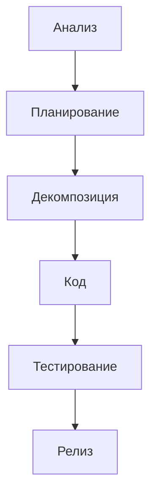

# Rules‑driven подход к разработке ПО

## 1. Порядок этапов (строгая последовательность)
1. **Анализ** – сбор требований, контекста, ограничений.
2. **Планирование** – формулирование стратегии, архитектурных решений, подходов.
3. **Декомпозиция** – разбивка на задачи, определение шагов и критериев проверки.
4. **Код** – реализация только после полного завершения пунктов 1‑3.

## 2. Обязательные артефакты
| Этап | Артефакт | Формат | Краткое описание |
|------|----------|--------|-------------------|
| Анализ | Требования | `requirements.md` | Перечень бизнес‑требований, пользовательских историй, ограничений. |
| Анализ | Контекст | `context.md` | Описание окружения, зависимостей, технологических ограничений. |
| Планирование | Архитектурный план | `architecture.md` | Диаграммы, описания компонентов, их взаимодействий. |
| Планирование | Техническое задание | `specification.md` | Подробные требования к реализации, критерии приёмки. |
| Декомпозиция | План задач | `tasks.md` | Список задач, их приоритет, оценки и зависимости. |
| Декомпозиция | Критерии проверки | `acceptance_criteria.md` | Тест‑кейсы, метрики качества, Definition of Done. |
| Код | Исходный код | `src/…` | Реализация, соответствующая всем вышеуказанным артефактам. |

## 3. Запреты (нельзя переходить без завершения)
- **Запрещено** переходить к следующему этапу, пока не завершены все артефакты текущего.
- **Запрещено** писать любой код до полного завершения этапов **Анализ**, **Планирование** и **Декомпозиция**.
- **Запрещено** изменять уже утверждённые артефакты без согласования и обновления всех зависимых документов.

## 4. Ключевой предохранитель
> **Запрещено** писать код до завершения этапов **Анализ** и **Планирование**. Любая попытка нарушения будет фиксироваться в журнале `logs/rules_violation.log` и требовать исправления перед продолжением работы.

## 5. Пример базового workflow

*Все команды разработки обязаны соблюдать данный набор правил. Нарушения фиксируются и рассматриваются на ретроспективах.*