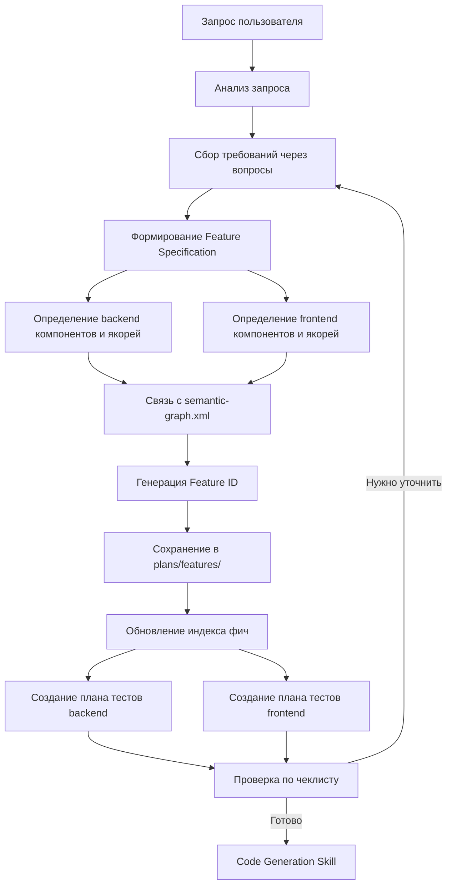

# GRACE Skill: Планирование фичи (Grace Plan)

## Назначение

Этот скилл обеспечивает планирование новой фичи и формирование исчерпывающего Feature Specification Document в соответствии с методологией GRACE для проекта TrackHub (Java 17 + Spring Boot + Angular 17).

---

## Ключевые принципы

1. **Анализ-первый** — сначала понять требования, потом планировать
2. **Уточнение через вопросы** — использовать `ask_followup_question` для сбора недостающей информации
3. **Связь с архитектурой** — все компоненты должны быть связаны с `.kilocode/semantic-graph.xml`
4. **Контракт-первый** — контракты определяются до написания кода
5. **TDD-подход** — план тестов создаётся вместе со спецификацией
6. **Стек-специфичность** — все решения учитывают Java 17 + Spring Boot + Angular 17

---

## Технологический стек TrackHub

### Backend
- **Java**: 17
- **Spring Boot**: 3.3.x
- **Spring Data JPA**: Hibernate ORM
- **PostgreSQL**: 16
- **Spring Security**: JWT аутентификация
- **SpringDoc OpenAPI**: Swagger UI
- **Liquibase**: миграции БД

### Frontend
- **Angular**: 17+
- **TypeScript**: 5.x
- **PrimeNG**: 17+ (UI компоненты)
- **PrimeFlex**: CSS фреймворк
- **RxJS / Signals**: реактивное программирование
- **Angular HttpClient**: HTTP запросы

### Архитектура
- **REST API**: Spring Boot контроллеры
- **Сервисный слой**: бизнес-логика в сервисах
- **Репозитории**: Spring Data JPA
- **DTO**: request/response объекты
- **Безопасность**: JWT + Spring Security + PermissionService (OWNER/EDIT/VIEW)

---

## Процесс планирования

### 1. Анализ запроса пользователя

**Цель:** Понять, что именно нужно реализовать.

**Действия:**
- Изучить запрос пользователя
- Определить тип фичи (backend, frontend, интеграционная)
- Выявить затронутые компоненты
- Проверить существующую архитектуру в `.kilocode/semantic-graph.xml`
- Проверить существующую структуру проекта в `.kilocode/rules/project_context.md`

**Вопросы для анализа:**
- Это backend фича (REST API, сервисы, репозитории)?
- Это frontend фича (Angular компоненты, сервисы)?
- Это интеграционная фича (оба слоя)?
- Какие сущности затронуты (User, Track, Note, TrackPermission)?
- Какие права доступа нужны (OWNER, EDIT, VIEW)?

### 2. Сбор требований через вопросы

**Цель:** Получить всю необходимую информацию для спецификации.

**Инструмент:** `ask_followup_question`

**Типы вопросов:**
- Функциональные требования (что должна делать фича)
- Нефункциональные требования (производительность, безопасность)
- Ограничения (технологические, бизнесовые)
- Интеграционные точки (какие компоненты затронуты)
- UI/UX требования (для фронтенда)

**Примеры вопросов для TrackHub:**
- "Какие CRUD операции нужны для этой сущности?"
- "Какие права доступа нужны для этой операции (OWNER/EDIT/VIEW)?"
- "Какие REST API эндпоинты требуются?"
- "Какие Angular компоненты нужны для этой фичи?"
- "Требуется ли валидация на клиенте и сервере?"
- "Какие DTO нужны (request/response)?"
- "Требуется ли миграция БД (Liquibase)?"

### 3. Формирование Feature Specification Document

**Цель:** Создать исчерпывающий документ спецификации.

**Шаблон:** Использовать `.kilocode/templates/feature-spec-template.md`

**Обязательные разделы:**
- **Overview** — краткое описание фичи
- **Requirements** — функциональные и нефункциональные требования
- **Architecture** — архитектурные решения
- **Components** — список компонентов с якорями
- **Contracts** — контракты для каждого компонента
- **API** — REST API эндпоинты (для backend)
- **UI** — Angular компоненты (для frontend)
- **Test Plan** — план тестирования
- **Dependencies** — зависимости от других компонентов

### 4. Определение компонентов, якорей и контрактов

**Цель:** Определить структуру кода до его написания.

#### Backend компоненты

**Типы компонентов:**
- **Controller** — REST контроллеры (`src/main/java/org/homework/controller/`)
- **Service** — бизнес-логика (`src/main/java/org/homework/service/`)
- **Repository** — JPA репозитории (`src/main/java/org/homework/repository/`)
- **Model** — JPA сущности (`src/main/java/org/homework/model/`)
- **DTO** — request/response объекты (`src/main/java/org/homework/dto/`)
- **Security** — фильтры, конфигурация (`src/main/java/org/homework/security/`)
- **Exception** — обработка ошибок (`src/main/java/org/homework/exception/`)

**Пример структуры:**
```
Backend:
- TrackController (ANCHOR: TRACK_CONTROLLER)
- TrackService (ANCHOR: TRACK_SERVICE)
- TrackRepository (ANCHOR: TRACK_REPOSITORY)
- Track (ANCHOR: TRACK_MODEL)
- TrackDto (ANCHOR: TRACK_DTO)
- CreateTrackRequest (ANCHOR: CREATE_TRACK_REQUEST)
- UpdateTrackRequest (ANCHOR: UPDATE_TRACK_REQUEST)
```

#### Frontend компоненты

**Типы компонентов:**
- **Feature Component** — UI компоненты (`frontend/src/app/features/`)
- **Core Service** — сервисы (`frontend/src/app/core/services/`)
- **Shared Component** — общие компоненты (`frontend/src/app/shared/components/`)
- **Model** — TypeScript модели (`frontend/src/app/shared/models/`)
- **Guard** — маршрутизация (`frontend/src/app/core/guards/`)
- **Interceptor** — HTTP перехватчики (`frontend/src/app/core/interceptors/`)

**Пример структуры:**
```
Frontend:
- TrackListComponent (ANCHOR: TRACK_LIST_COMPONENT)
- TrackDetailComponent (ANCHOR: TRACK_DETAIL_COMPONENT)
- TrackService (ANCHOR: TRACK_SERVICE_FRONTEND)
- TrackModel (ANCHOR: TRACK_MODEL_FRONTEND)
```

### 5. Связь с `.kilocode/semantic-graph.xml`

**Цель:** Обеспечить целостность архитектуры.

**Действия:**
- Добавить новые компоненты в `<components>` секцию
- Добавить новые связи в `<relationships>` секцию
- Обновить `<decisions>` секцию с архитектурными решениями
- Убедиться, что все `id` уникальны

**Пример добавления backend компонента:**
```xml
<component id="TRACK_SERVICE" kind="service" path="src/main/java/org/homework/service/TrackService.java">
  <role>Бизнес-логика управления треками</role>
  <depends-on ref="TRACK_REPOSITORY"/>
  <depends-on ref="PERMISSION_SERVICE"/>
  <exposes>
    <api name="createTrack" type="method">Создание нового трека</api>
    <api name="updateTrack" type="method">Обновление трека</api>
    <api name="deleteTrack" type="method">Удаление трека</api>
    <api name="getTrack" type="method">Получение трека по ID</api>
    <api name="listTracks" type="method">Получение списка треков</api>
  </exposes>
</component>
```

**Пример добавления frontend компонента:**
```xml
<component id="TRACK_LIST_COMPONENT" kind="component" path="frontend/src/app/features/dashboard/dashboard.component.ts">
  <role>UI компонент для отображения списка треков</role>
  <depends-on ref="TRACK_SERVICE_FRONTEND"/>
  <depends-on ref="AUTH_SERVICE_FRONTEND"/>
  <exposes>
    <api name="displayTracks" type="ui">Отображение таблицы треков</api>
  </exposes>
</component>
```

### 6. Создание черновика плана тестов

**Цель:** Определить стратегию тестирования до написания кода.

#### Backend тесты (JUnit 5 + Spring Test)

**Level 1: Детерминированные тесты**
- Проверка постусловий контрактов
- Возвращаемые значения
- Состояние объектов
- Исключения
- Валидация DTO

**Level 2: Тесты траектории**
- Проверка log-маркеров (SLF4J)
- ENTRY, EXIT, BRANCH, DECISION, ERROR, STATE_CHANGE логи
- Покрытие всех ветвлений

**Level 3: Интеграционные тесты**
- E2E сценарии с Spring Boot Test
- Интеграция с PostgreSQL (Testcontainers)
- Тестирование REST API (MockMvc)
- Тестирование Spring Security

#### Frontend тесты (Jasmine/Karma)

**Level 1: Детерминированные тесты**
- Проверка постусловий контрактов
- Возвращаемые значения
- Состояние компонентов
- Обработка ошибок

**Level 2: Тесты траектории**
- Проверка log-маркеров (logLine)
- ENTRY, EXIT, BRANCH, DECISION, ERROR, STATE_CHANGE логи
- Покрытие всех ветвлений

**Level 3: Интеграционные тесты**
- E2E сценарии (Cypress/Protractor)
- Интеграция с backend API
- Тестирование UI компонентов

**Формат плана тестов:**
```markdown
## Test Plan

### Backend Tests (JUnit 5 + Spring Test)

#### Level 1: Детерминированные тесты
- [ ] Тест 1: Проверка создания трека
- [ ] Тест 2: Проверка валидации DTO
- [ ] Тест 3: Проверка прав доступа

#### Level 2: Тесты траектории
- [ ] Тест 1: Проверка ENTRY/EXIT логов
- [ ] Тест 2: Проверка BRANCH логов
- [ ] Тест 3: Проверка STATE_CHANGE логов

#### Level 3: Интеграционные тесты
- [ ] Тест 1: E2E сценарий создания трека
- [ ] Тест 2: Интеграция с PostgreSQL
- [ ] Тест 3: Тестирование REST API (MockMvc)

### Frontend Tests (Jasmine/Karma)

#### Level 1: Детерминированные тесты
- [ ] Тест 1: Проверка отображения списка треков
- [ ] Тест 2: Проверка валидации форм
- [ ] Тест 3: Проверка обработки ошибок

#### Level 2: Тесты траектории
- [ ] Тест 1: Проверка ENTRY/EXIT логов
- [ ] Тест 2: Проверка BRANCH логов

#### Level 3: Интеграционные тесты
- [ ] Тест 1: E2E сценарий создания трека
- [ ] Тест 2: Интеграция с backend API
```

---

## Генерация Feature ID и сохранение

### Шаг 1: Генерация Feature ID

**Формат:** `FEAT-{NUMBER}`

**Примеры:**
- FEAT-001
- FEAT-002
- FEAT-003

**Действия:**
1. Проверить существующие фичи в `plans/features/`
2. Определить следующий номер (максимальный + 1)
3. Сгенерировать уникальный Feature ID

**Пример проверки:**
```bash
# Список существующих фич
ls plans/features/
# FEAT-001.md
# FEAT-002.md
# FEAT-003.md

# Следующий номер: 004
# Feature ID: FEAT-004
```

### Шаг 2: Сохранение Feature Specification Document

**Путь:** `plans/features/FEAT-XXX.md`

**Действия:**
1. Создать файл `plans/features/FEAT-XXX.md` по шаблону
2. Заполнить все обязательные разделы
3. Установить статус `planning` в документе

**Пример структуры файла:**
```markdown
# Feature Specification: FEAT-004

## Status
planning

## Overview
...

## Requirements
...

## Architecture
...

## Components
...

## Contracts
...

## API
...

## UI
...

## Test Plan
...

## Dependencies
...

## Acceptance Criteria
...
```

### Шаг 3: Обновление индекса фич

**Файл:** `plans/features/README.md`

**Действия:**
1. Добавить новую фичу в список
2. Обновить статистику (количество фич)

**Пример обновления:**
```markdown
# Features

## Список фич

| Feature ID | Название | Статус | Дата создания |
|------------|----------|--------|---------------|
| FEAT-001 | CRUD для треков | completed | 2026-04-15 |
| FEAT-002 | CRUD для заметок | completed | 2026-04-16 |
| FEAT-003 | Система шаринга | in_progress | 2026-04-16 |
| FEAT-004 | [Название] | planning | 2026-04-17 |

## Статистика
- Всего фич: 4
- Завершено: 2
- В работе: 1
- В планировании: 1
```

### Шаг 4: Проверка сохранения

**Чеклист:**
- [ ] Feature ID сгенерирован (FEAT-XXX)
- [ ] Файл `plans/features/FEAT-XXX.md` создан
- [ ] Все разделы заполнены
- [ ] Статус установлен в `planning`
- [ ] Индекс `plans/features/README.md` обновлён

---

## Шаблон Feature Specification Document

Использовать шаблон из `.kilocode/templates/feature-spec-template.md`:

```markdown
# Feature Specification: [FEAT-XXX]

## Overview
Краткое описание фичи

## Requirements
### Functional Requirements
- Требование 1
- Требование 2

### Non-Functional Requirements
- Требование 1
- Требование 2

## Architecture
### Backend Components
- Controller (ANCHOR: COMPONENT_CONTROLLER)
- Service (ANCHOR: COMPONENT_SERVICE)
- Repository (ANCHOR: COMPONENT_REPOSITORY)
- Model (ANCHOR: COMPONENT_MODEL)
- DTO (ANCHOR: COMPONENT_DTO)

### Frontend Components
- Component (ANCHOR: COMPONENT_UI)
- Service (ANCHOR: COMPONENT_SERVICE_FRONTEND)
- Model (ANCHOR: COMPONENT_MODEL_FRONTEND)

### Data Flow
Описание потока данных

## Contracts
### Backend Component 1 (ANCHOR: COMPONENT_1)
```
[Контракт компонента]
```

### Frontend Component 1 (ANCHOR: COMPONENT_UI_1)
```
[Контракт компонента]
```

## API
### Endpoints
- POST /api/resource — описание
- GET /api/resource/{id} — описание
- PUT /api/resource/{id} — описание
- DELETE /api/resource/{id} — описание

### DTO
- CreateResourceRequest — описание
- UpdateResourceRequest — описание
- ResourceDto — описание

## UI
### Components
- Component1 — описание
- Component2 — описание

### Services
- Service1 — описание
- Service2 — описание

## Test Plan
### Backend Tests (JUnit 5 + Spring Test)
#### Level 1: Детерминированные тесты
- [ ] Тест 1
- [ ] Тест 2

#### Level 2: Тесты траектории
- [ ] Тест 1
- [ ] Тест 2

#### Level 3: Интеграционные тесты
- [ ] Тест 1
- [ ] Тест 2

### Frontend Tests (Jasmine/Karma)
#### Level 1: Детерминированные тесты
- [ ] Тест 1
- [ ] Тест 2

#### Level 2: Тесты траектории
- [ ] Тест 1
- [ ] Тест 2

#### Level 3: Интеграционные тесты
- [ ] Тест 1
- [ ] Тест 2

## Dependencies
- Зависимость 1
- Зависимость 2

## Acceptance Criteria
- [ ] Критерий 1
- [ ] Критерий 2
```

---

## Чеклист завершения планирования

### Обязательные проверки

- [ ] Все требования собраны через вопросы
- [ ] Feature ID сгенерирован (FEAT-XXX)
- [ ] Feature Specification Document создан в `plans/features/FEAT-XXX.md`
- [ ] Все разделы Feature Specification Document заполнены
- [ ] Статус фичи установлен в `planning`
- [ ] Все backend компоненты определены с уникальными ANCHOR_ID
- [ ] Все frontend компоненты определены с уникальными ANCHOR_ID
- [ ] Все контракты определены
- [ ] `.kilocode/semantic-graph.xml` обновлён
- [ ] План тестов создан (backend + frontend)
- [ ] Acceptance Criteria определены
- [ ] Зависимости от других компонентов учтены
- [ ] REST API эндпоинты определены
- [ ] DTO определены
- [ ] Angular компоненты определены
- [ ] Права доступа (OWNER/EDIT/VIEW) определены
- [ ] Индекс фич `plans/features/README.md` обновлён

### Критерий готовности

Планирование считается завершённым только при выполнении всех пунктов чеклиста.

---

## Связанные документы

- [GRACE Skills Index](./grace-skills-index.md) — индекс всех скиллов
- [Feature Spec Template](../templates/feature-spec-template.md) — шаблон спецификации
- [Semantic Graph](../semantic-graph.xml) — архитектура компонентов
- [Project Context](../rules/project_context.md) — контекст проекта TrackHub
- [Code Generation Skill](./grace-code-generation/SKILL.md) — следующий скилл после планирования
- [Semantic Markup Examples](../semantic-markup-examples/) — примеры семантической разметки для Java и TypeScript

---

## Workflow



---

## Примеры использования

### Пример 1: Backend фича
```
/kilo skill grace-plan "CRUD операции для заметок: создание, редактирование, удаление, перемещение в дереве"
```

### Пример 2: Frontend фича
```
/kilo skill grace-plan "UI компонент для редактирования заметки с Markdown редактором"
```

### Пример 3: Интеграционная фича
```
/kilo skill grace-plan "Система шаринга треков с другими пользователями с правами OWNER/EDIT/VIEW"
```

---

## Специфические правила для TrackHub

### Backend правила
- Все контроллеры должны использовать `@RestController` и `@RequestMapping`
- Все методы контроллеров должны иметь `@PreAuthorize` для проверки прав доступа
- Все DTO должны использовать Bean Validation (`@Valid`, `@NotBlank`, `@Size`)
- Все сервисы должны использовать `@Slf4j` для логирования
- Все методы сервисов должны иметь контракты с ANCHOR
- Все репозитории должны наследоваться от `JpaRepository`
- Все сущности должны иметь JPA аннотации (`@Entity`, `@Table`, `@Column`)

### Frontend правила
- Все компоненты должны использовать Angular Signals или RxJS
- Все сервисы должны использовать `HttpClient` с `AuthInterceptor`
- Все формы должны использовать Reactive Forms с валидацией
- Все компоненты должны иметь контракты с ANCHOR
- Все сервисы должны использовать `logLine` для логирования
- Все модели должны быть TypeScript интерфейсами

### Безопасность
- Все API эндпоинты должны быть защищены JWT
- Проверка прав доступа через `PermissionService` (OWNER/EDIT/VIEW)
- Валидация на клиенте и сервере
- Обработка ошибок через `GlobalExceptionHandler`

---

*Создано: 2026-04-17*
*Обновлено: 2026-04-17*
*GRACE Skill: Grace Plan (TrackHub)*
