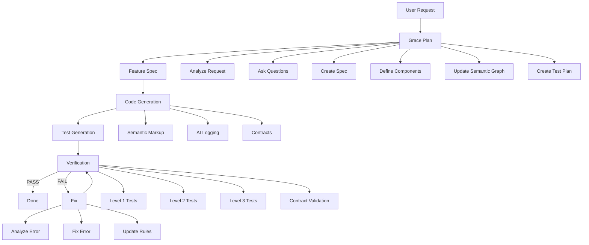

# GRACE Skills Index

## Обзор

GRACE (Generic Rule-based Architecture for Contracted Execution) — это методология разработки, которая делает код понятным для AI-агентов через семантическую разметку, AI-friendly логирование и контракты.

Этот индекс содержит все grace-скиллы для KiloCode, адаптированные для проекта TrackHub (Java 17 + Spring Boot + Angular 17).

---

## Список скиллов

### 1. [Grace Plan Skill](./grace-plan/SKILL.md)

**Назначение**: Планирование фичи с формированием полного Feature Specification Document.

**Ключевые принципы**:
- Анализ-первый — сначала понять требования, потом планировать
- Уточнение через вопросы — использовать `ask_followup_question` для сбора информации
- Связь с архитектурой — все компоненты связаны с `.kilocode/semantic-graph.xml`
- Контракт-первый — контракты определяются до написания кода
- TDD-подход — план тестов создаётся вместе со спецификацией

**Обязательные этапы**:
- Анализ запроса пользователя
- Сбор требований через вопросы
- Формирование Feature Specification Document
- Определение компонентов, якорей и контрактов
- Связь с `.kilocode/semantic-graph.xml`
- Создание черновика плана тестов

**Связанные документы**:
- [Feature Spec Template](../templates/feature-spec-template.md)
- [Semantic Graph](../semantic-graph.xml)

---

### 2. [Semantic Markup Skill](./grace-semantic-markup/SKILL.md)

**Назначение**: Создание и поддержка семантической разметки кода.

**Ключевые принципы**:
- Контракт-первый — код должен соответствовать контракту
- Явная семантика — каждый блок имеет ANCHOR и смысл
- Наблюдаемость — логи позволяют восстановить траекторию
- Запрет разрушения — @ForbiddenChanges защищает критичную логику
- Без догадок — при неопределённости сохранить поведение

**Обязательные элементы**:
- ANCHOR (Якорь)
- PURPOSE (Назначение)
- @PreConditions (Предусловия)
- @PostConditions (Постусловия)
- @Invariants (Инварианты)
- @SideEffects (Побочные эффекты)
- @ForbiddenChanges (Запреты)
- @AllowedRefactorZone (Опционально)

**Связанные документы**:
- [Semantic Markup Rules](../rules/semantic-code-markup.md)
- [Примеры](../rules/semantic-markup-examples/)

---

### 3. [AI Logging Skill](./grace-ai-logging/SKILL.md)

**Назначение**: Создание структурированных логов для AI-агентов.

**Ключевые принципы**:
- Логи — это интерфейс самокоррекции
- Код проектируется под цикл: ожидание → выполнение → лог → сравнение → исправление

**Обязательные свойства логов**:
- Маркировка типа записи (INFO/DEBUG/ERROR)
- Ссылка на ANCHOR
- Вход/выход из критичных функций
- Логирование условий и ветвлений
- Логирование причин отказа
- Ключевые входные данные
- Ключевые результаты
- Идентификаторы сущностей

**Точки логирования**:
- ENTRY — вход в функцию
- EXIT — успешный выход
- BRANCH — ветвление
- DECISION — принятие решения
- CHECK — результат проверки
- ERROR — ошибка/отказ
- RETRY — повторная попытка
- STATE_CHANGE — изменение состояния

**Связанные документы**:
- [AI Logging Rules](../rules/ai-logging.md)

---

### 4. [Contract Validation Skill](./grace-contract-validation/SKILL.md)

**Назначение**: Проверка соответствия кода контрактам.

**Ключевые принципы**:
- Контракт-первый — код должен соответствовать контракту
- Автоматическая проверка — все контракты проверяются автоматически
- Детальная диагностика — каждое нарушение описывается с контекстом
- Обратная связь — результаты используются для улучшения

**Обязательные проверки**:
- Проверка структуры контракта
- Проверка соответствия якорей
- Проверка соблюдения контракта (предусловия, постусловия, инварианты, побочные эффекты, запреты)

**Уровни серьёзности**:
- ERROR — критичное нарушение контракта
- WARNING — потенциальная проблема
- INFO — информационное сообщение

**Связанные документы**:
- [Semantic Markup Rules](../rules/semantic-code-markup.md)
- [Error Patterns](../rules/error-patterns.md)

---

### 5. [Test Generation Skill](./grace-test-generation/SKILL.md)

**Назначение**: Создание трёхуровневой системы тестирования.

**Ключевые принципы**:
- TDD — тесты пишутся ДО кода
- 3 уровня тестирования — детерминированные, траекторные, интеграционные
- Проверка контрактов — тесты верифицируют постусловия
- Проверка логов — тесты верифицируют log-маркеры
- E2E сценарии — тесты проверяют сквозной поток

**Уровни тестирования**:

**Level 1: Детерминированные тесты**
- Проверка постусловий контрактов
- Возвращаемые значения, состояние объектов, исключения

**Level 2: Тесты траектории**
- Проверка log-маркеров
- ENTRY, EXIT, BRANCH, DECISION, ERROR, STATE_CHANGE логи

**Level 3: Интеграционные тесты**
- Проверка E2E сценариев
- Сквозной поток данных, интеграция компонентов, API эндпоинты, UI сценарии

**Связанные документы**:
- [TDD Rules](../rules/TDD.md)
- [Semantic Markup Rules](../rules/semantic-code-markup.md)

---

### 6. [Code Generation Skill](./grace-code-generation/SKILL.md)

**Назначение**: Генерация кода в соответствии с методологией GRACE.

**Ключевые принципы**:
- Контракт-первый — код генерируется на основе контракта
- Семантическая разметка — каждый блок имеет ANCHOR и контракт
- AI-friendly логирование — ENTRY/EXIT/BRANCH/DECISION/ERROR точки
- TDD — тесты пишутся ДО кода
- Соответствие спецификации — код соответствует Feature Spec

**Процесс генерации**:
1. Анализ Feature Specification
2. Создание контрактов
3. Генерация кода с логированием
4. Генерация тестов

**Шаблоны генерации**:
- Backend (Java 17 + Spring Boot) — сервисные методы, контроллеры
- Frontend (Angular 17 + TypeScript) — сервисы, компоненты

**Связанные документы**:
- [Semantic Markup Rules](../rules/semantic-code-markup.md)
- [AI Logging Rules](../rules/ai-logging.md)
- [Project Context](../rules/project_context.md)
- [Примеры](../examples/)

---

### 7. [Verification Skill](./grace-verification/SKILL.md)

**Назначение**: Комплексная верификация кода.

**Ключевые принципы**:
- 3 уровня верификации — детерминированные тесты, тесты траектории, интеграционные тесты
- Проверка контрактов — верификация соответствия кода контрактам
- Проверка логов — верификация наличия и корректности log-маркеров
- Автоматизация — все проверки автоматизированы
- Отчётность — детальные отчёты о результатах верификации

**Процесс верификации**:
1. Запуск детерминированных тестов (Level 1)
2. Запуск тестов траектории (Level 2)
3. Запуск интеграционных тестов (Level 3)
4. Валидация контрактов
5. Генерация отчёта

**Критерии верификации**:
- Все тесты должны проходить
- Покрытие кода ≥ 80%
- Все log-маркеры присутствуют
- Все контракты валидны
- Нет критичных ошибок

**Связанные документы**:
- [Test Generation Skill](./grace-test-generation/SKILL.md)
- [Contract Validation Skill](./grace-contract-validation/SKILL.md)
- [AI Logging Rules](../rules/ai-logging.md)

---

### 8. [Fix Skill](./grace-fix/SKILL.md)

**Назначение**: Исправление ошибок с сохранением контрактов.

**Ключевые принципы**:
- Сохранение контрактов — контракты не меняются без явной необходимости
- Сохранение семантики — смысл кода не меняется
- Сохранение логов — log-маркеры сохраняются
- Минимальные изменения — только необходимые исправления
- Обновление правил — новые ошибки добавляются в error-patterns.md

**Процесс исправления**:
1. Анализ ошибки
2. Понимание причины
3. Исправление ошибки
4. Обновление теста
5. Верификация исправления
6. Обновление error-patterns.md

**Шаблоны исправления**:
- Исправление логики
- Добавление логов
- Исправление контракта

**Связанные документы**:
- [Error Patterns](../rules/error-patterns.md)
- [Error Driven Learning](../rules/error-driven-learning.md)
- [Semantic Markup Rules](../rules/semantic-code-markup.md)

---

## Workflow GRACE



---

## Специфика TrackHub

### Backend (Java 17 + Spring Boot)

- **Логирование**: SLF4J + Logback с MDC
- **Валидация**: Bean Validation (@Valid, @Size, @Pattern, @NotBlank)
- **Безопасность**: Spring Security + JWT, @PreAuthorize на контроллерах
- **Тесты**: JUnit 5 + Spring Test, Mockito
- **База данных**: PostgreSQL 16 + Liquibase

### Frontend (Angular 17 + TypeScript)

- **Логирование**: кастомная функция logLine из core/lib/log.ts
- **HTTP**: Angular HttpClient с глобальным AuthInterceptor
- **Формы**: Reactive Forms с клиентской валидацией
- **Тесты**: Jasmine/Karma для юнит-тестов, Cypress для E2E
- **UI**: PrimeNG компоненты, PrimeFlex для стилей

---

## Связанные документы

### Основные документы
- [GRACE.md](../GRACE.md) — основная документация GRACE
- [README.md](../README.md) — обзор проекта
- [Grace Plan Skill](./grace-plan/SKILL.md) — планирование фичи

### Правила
- [Semantic Markup Rules](../rules/semantic-code-markup.md) — правила разметки
- [AI Logging Rules](../rules/ai-logging.md) — правила логирования
- [Semantic Graph](../semantic-graph.xml) — архитектура компонентов
- [Project Context](../rules/project_context.md) — контекст проекта
- [Error Patterns](../rules/error-patterns.md) — паттерны ошибок
- [Error Driven Learning](../rules/error-driven-learning.md) — обучение на ошибках
- [TDD Rules](../rules/TDD.md) — правила TDD

### Примеры
- [Java Service Example](../examples/trackhub-java-service-example.md)
- [TypeScript Service Example](../examples/trackhub-typescript-service-example.md)
- [Semantic Markup Examples](../rules/semantic-markup-examples/)

### Шаблоны
- [Feature Spec Template](../templates/feature-spec-template.md)
- [Validation Report Template](../templates/validation-report-template.md)

---

## Быстрый старт

### 1. Создание новой фичи

```bash
# 1. Использовать Grace Plan Skill для планирования
# Агент автоматически:
#   - Проанализирует запрос
#   - Задаст уточняющие вопросы
#   - Создаст Feature Specification
#   - Определит компоненты и контракты
#   - Обновит semantic-graph.xml
#   - Создаст план тестов

# 2. Сгенерировать код с использованием Code Generation Skill
# 3. Сгенерировать тесты с использованием Test Generation Skill
# 4. Запустить верификацию с использованием Verification Skill
```

### 2. Использование скиллов

Каждый скилл может быть использован независимо или в комбинации с другими:

- **Grace Plan Skill** — для планирования фичи и создания спецификации
- **Semantic Markup Skill** — для создания контрактов
- **AI Logging Skill** — для добавления логов
- **Contract Validation Skill** — для проверки контрактов
- **Test Generation Skill** — для создания тестов
- **Code Generation Skill** — для генерации кода
- **Verification Skill** — для верификации
- **Fix Skill** — для исправления ошибок

---

## Метрики качества

| Метрика | Цель |
|---------|------|
| Покрытие кода тестами | ≥ 80% |
| Проход тестов | 100% |
| Валидность контрактов | 100% |
| Наличие log-маркеров | 100% (для критичных функций) |
| Соответствие кода контрактам | 100% |

---

## Обучение и поддержка

### Ресурсы для обучения
- [GRACE.md](../GRACE.md) — полное описание методологии
- [Примеры](../rules/semantic-markup-examples/) — эталонные примеры
- [Error Patterns](../rules/error-patterns.md) — паттерны ошибок

### Поддержка
При возникновении вопросов или проблем:
1. Проверить соответствующие правила в `.kilocode/rules/`
2. Посмотреть примеры в `.kilocode/examples/`
3. Проверить error-patterns.md для похожих проблем

---

*Создано: 2026-04-17*
*Обновлено: 2026-04-17*
*GRACE Skills Index*
*Адаптировано для TrackHub: Java 17 + Spring Boot + Angular 17*
