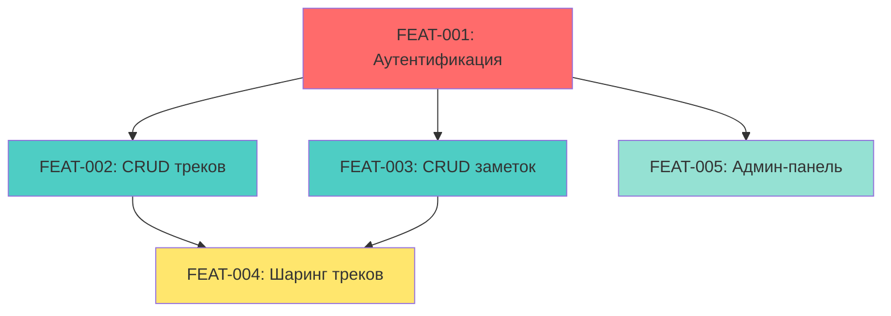

# Features

Эта директория содержит Feature Specifications для всех фич проекта TrackHub.

## Список фич

| Feature ID | Название | Статус | Дата создания | Приоритет |
|------------|----------|--------|---------------|-----------|
| FEAT-001 | Аутентификация и авторизация | planning | 2026-04-17 | P0 |
| FEAT-002 | CRUD для треков | planning | 2026-04-17 | P0 |
| FEAT-003 | CRUD для заметок | planning | 2026-04-17 | P0 |
| FEAT-004 | Система шаринга треков | planning | 2026-04-17 | P1 |
| FEAT-005 | Админ-панель | planning | 2026-04-17 | P2 |

## Статистика
- Всего фич: 5
- Завершено: 0
- В работе: 0
- В планировании: 5

## Зависимости



## Приоритеты
- **P0 (Критично)**: Базовая функциональность, без которой система не работает
- **P1 (Важно)**: Важная функциональность, но не блокирующая
- **P2 (Желательно)**: Улучшения и дополнительные возможности

## Структура директорий

```
plans/
├── features/           # Feature Specifications
│   ├── FEAT-XXX-feature-name.md
│   └── README.md       # Этот файл
├── validation/         # Validation Reports
│   ├── V-FEAT-XXX-feature-name.xml
│   └── README.md
└── tasks.md           # Список задач
```

## Формат имени файла

- Feature Spec: `FEAT-XXX-feature-name.md`
- Validation Report: `V-FEAT-XXX-feature-name.xml`

Примеры:
- `FEAT-001-user-authentication.md`
- `V-FEAT-001-user-authentication.xml`

## Шаблон Feature Spec

См. `.kilocode/templates/feature-spec-template.md`
