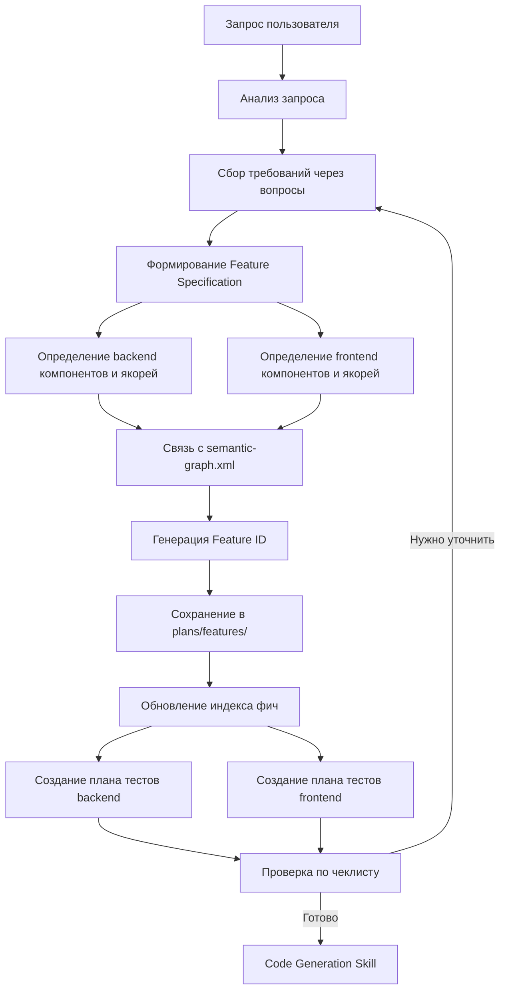

# Нереализованные требования из GRACE Plan SKILL.md

**Дата анализа:** 2026-04-17  
**Источник:** `.kilocode/skills/grace-plan/SKILL.md`  
**Проверяемый документ:** `plans/ТЗ_Приложение_Треки_Развития.md`

---

## Обзор

ТЗ_Приложение_Треки_Развития.md содержит полное техническое задание на разработку приложения TrackHub, но **не следует методологии GRACE** для планирования фич. В документе отсутствуют ключевые элементы, требуемые SKILL.md.

---

## Категория 1: Feature Specification Document

### Требование из SKILL.md
> Создать исчерпывающий Feature Specification Document с обязательными разделами:
> - **Overview** — краткое описание фичи
> - **Requirements** — функциональные и нефункциональные требования
> - **Architecture** — архитектурные решения
> - **Components** — список компонентов с якорями
> - **Contracts** — контракты для каждого компонента
> - **API** — REST API эндпоинты (для backend)
> - **UI** — Angular компоненты (для frontend)
> - **Test Plan** — план тестирования
> - **Dependencies** — зависимости от других компонентов
> - **Acceptance Criteria** — критерии приёмки

### Статус в ТЗ
❌ **НЕ РЕАЛИЗОВАНО**

ТЗ содержит:
- ✓ Технологический стек
- ✓ Функциональные требования (Backend и Frontend)
- ✓ Модель базы данных
- ✓ API спецификация
- ✓ Нефункциональные требования
- ✓ Указания по генерации кода

ТЗ НЕ содержит:
- ❌ Раздел "Overview" для каждой фичи
- ❌ Раздел "Architecture" с архитектурными решениями
- ❌ Раздел "Components" с якорями (ANCHOR_ID)
- ❌ Раздел "Contracts" с контрактами компонентов
- ❌ Раздел "Test Plan" с планом тестирования
- ❌ Раздел "Dependencies" с зависимостями
- ❌ Раздел "Acceptance Criteria" с критериями приёмки

---

## Категория 2: Определение компонентов с якорями

### Требование из SKILL.md
> Определить структуру кода до его написания с уникальными ANCHOR_ID для каждого компонента.

#### Backend компоненты
- **Controller** — REST контроллеры (`src/main/java/org/homework/controller/`)
- **Service** — бизнес-логика (`src/main/java/org/homework/service/`)
- **Repository** — JPA репозитории (`src/main/java/org/homework/repository/`)
- **Model** — JPA сущности (`src/main/java/org/homework/model/`)
- **DTO** — request/response объекты (`src/main/java/org/homework/dto/`)
- **Security** — фильтры, конфигурация (`src/main/java/org/homework/security/`)
- **Exception** — обработка ошибок (`src/main/java/org/homework/exception/`)

**Пример структуры:**
```
Backend:
- TrackController (ANCHOR: TRACK_CONTROLLER)
- TrackService (ANCHOR: TRACK_SERVICE)
- TrackRepository (ANCHOR: TRACK_REPOSITORY)
- Track (ANCHOR: TRACK_MODEL)
- TrackDto (ANCHOR: TRACK_DTO)
- CreateTrackRequest (ANCHOR: CREATE_TRACK_REQUEST)
- UpdateTrackRequest (ANCHOR: UPDATE_TRACK_REQUEST)
```

#### Frontend компоненты
- **Feature Component** — UI компоненты (`frontend/src/app/features/`)
- **Core Service** — сервисы (`frontend/src/app/core/services/`)
- **Shared Component** — общие компоненты (`frontend/src/app/shared/components/`)
- **Model** — TypeScript модели (`frontend/src/app/shared/models/`)
- **Guard** — маршрутизация (`frontend/src/app/core/guards/`)
- **Interceptor** — HTTP перехватчики (`frontend/src/app/core/interceptors/`)

**Пример структуры:**
```
Frontend:
- TrackListComponent (ANCHOR: TRACK_LIST_COMPONENT)
- TrackDetailComponent (ANCHOR: TRACK_DETAIL_COMPONENT)
- TrackService (ANCHOR: TRACK_SERVICE_FRONTEND)
- TrackModel (ANCHOR: TRACK_MODEL_FRONTEND)
```

### Статус в ТЗ
❌ **НЕ РЕАЛИЗОВАНО**

ТЗ описывает структуру проекта (раздел 8.1 и 8.2), но:
- ❌ Не использует ANCHOR_ID для компонентов
- ❌ Не связывает компоненты с якорями
- ❌ Не определяет контракты для компонентов

---

## Категория 3: Связь с `.kilocode/semantic-graph.xml`

### Требование из SKILL.md
> Обеспечить целостность архитектуры:
> - Добавить новые компоненты в `<components>` секцию
> - Добавить новые связи в `<relationships>` секцию
> - Обновить `<decisions>` секцию с архитектурными решениями
> - Убедиться, что все `id` уникальны

**Пример добавления backend компонента:**
```xml
<component id="TRACK_SERVICE" kind="service" path="src/main/java/org/homework/service/TrackService.java">
  <role>Бизнес-логика управления треками</role>
  <depends-on ref="TRACK_REPOSITORY"/>
  <depends-on ref="PERMISSION_SERVICE"/>
  <exposes>
    <api name="createTrack" type="method">Создание нового трека</api>
    <api name="updateTrack" type="method">Обновление трека</api>
    <api name="deleteTrack" type="method">Удаление трека</api>
    <api name="getTrack" type="method">Получение трека по ID</api>
    <api name="listTracks" type="method">Получение списка треков</api>
  </exposes>
</component>
```

### Статус в ТЗ
❌ **НЕ РЕАЛИЗОВАНО**

ТЗ:
- ❌ Не упоминает `.kilocode/semantic-graph.xml`
- ❌ Не описывает связь компонентов с семантическим графом
- ❌ Не определяет архитектурные решения в формате ADR

---

## Категория 4: План тестов (TDD-подход)

### Требование из SKILL.md
> Определить стратегию тестирования до написания кода.

#### Backend тесты (JUnit 5 + Spring Test)

**Level 1: Детерминированные тесты**
- Проверка постусловий контрактов
- Возвращаемые значения
- Состояние объектов
- Исключения
- Валидация DTO

**Level 2: Тесты траектории**
- Проверка log-маркеров (SLF4J)
- ENTRY, EXIT, BRANCH, DECISION, ERROR, STATE_CHANGE логи
- Покрытие всех ветвлений

**Level 3: Интеграционные тесты**
- E2E сценарии с Spring Boot Test
- Интеграция с PostgreSQL (Testcontainers)
- Тестирование REST API (MockMvc)
- Тестирование Spring Security

#### Frontend тесты (Jasmine/Karma)

**Level 1: Детерминированные тесты**
- Проверка постусловий контрактов
- Возвращаемые значения
- Состояние компонентов
- Обработка ошибок

**Level 2: Тесты траектории**
- Проверка log-маркеров (logLine)
- ENTRY, EXIT, BRANCH, DECISION, ERROR, STATE_CHANGE логи
- Покрытие всех ветвлений

**Level 3: Интеграционные тесты**
- E2E сценарии (Cypress/Protractor)
- Интеграция с backend API
- Тестирование UI компонентов

### Статус в ТЗ
❌ **НЕ РЕАЛИЗОВАНО**

ТЗ содержит:
- ✓ Упоминание тестовых сценариев UI (раздел 4.3)

ТЗ НЕ содержит:
- ❌ Структурированный план тестов (Level 1, 2, 3)
- ❌ Детерминированные тесты для backend
- ❌ Тесты траектории для backend
- ❌ Интеграционные тесты для backend
- ❌ Детерминированные тесты для frontend
- ❌ Тесты траектории для frontend
- ❌ Интеграционные тесты для frontend

---

## Категория 5: Генерация Feature ID

### Требование из SKILL.md
> Генерация уникального Feature ID в формате `FEAT-{NUMBER}`

**Примеры:**
- FEAT-001
- FEAT-002
- FEAT-003

**Действия:**
1. Проверить существующие фичи в `plans/features/`
2. Определить следующий номер (максимальный + 1)
3. Сгенерировать уникальный Feature ID

### Статус в ТЗ
❌ **НЕ РЕАЛИЗОВАНО**

ТЗ:
- ❌ Не использует Feature ID (FEAT-XXX)
- ❌ Не разбивает систему на фичи
- ❌ Не определяет приоритеты фич

---

## Категория 6: Сохранение Feature Specification Document

### Требование из SKILL.md
> Сохранить Feature Specification Document в `plans/features/FEAT-XXX.md`

**Действия:**
1. Создать файл `plans/features/FEAT-XXX.md` по шаблону
2. Заполнить все обязательные разделы
3. Установить статус `planning` в документе

**Пример структуры файла:**
```markdown
# Feature Specification: FEAT-004

## Status
planning

## Overview
...

## Requirements
...

## Architecture
...

## Components
...

## Contracts
...

## API
...

## UI
...

## Test Plan
...

## Dependencies
...

## Acceptance Criteria
...
```

### Статус в ТЗ
❌ **НЕ РЕАЛИЗОВАНО**

ТЗ:
- ❌ Не разбит на отдельные файлы фич
- ❌ Не использует шаблон Feature Specification Document
- ❌ Не определяет статус фич (planning, in_progress, completed)

---

## Категория 7: Обновление индекса фич

### Требование из SKILL.md
> Обновить индекс фич в `plans/features/README.md`

**Действия:**
1. Добавить новую фичу в список
2. Обновить статистику (количество фич)

**Пример обновления:**
```markdown
# Features

## Список фич

| Feature ID | Название | Статус | Дата создания |
|------------|----------|--------|---------------|
| FEAT-001 | CRUD для треков | completed | 2026-04-15 |
| FEAT-002 | CRUD для заметок | completed | 2026-04-16 |
| FEAT-003 | Система шаринга | in_progress | 2026-04-16 |
| FEAT-004 | [Название] | planning | 2026-04-17 |

## Статистика
- Всего фич: 4
- Завершено: 2
- В работе: 1
- В планировании: 1
```

### Статус в ТЗ
❌ **НЕ РЕАЛИЗОВАНО**

ТЗ:
- ❌ Не содержит индекса фич
- ❌ Не содержит статистики фич
- ❌ Не отслеживает статус фич

---

## Категория 8: Контракт-первый подход

### Требование из SKILL.md
> Контракты определяются до написания кода

**Контракт должен содержать:**
- ANCHOR_ID
- PURPOSE
- @PreConditions
- @PostConditions
- @Invariants
- @SideEffects
- @ForbiddenChanges
- @AllowedRefactorZone

### Статус в ТЗ
❌ **НЕ РЕАЛИЗОВАНО**

ТЗ:
- ❌ Не определяет контракты для компонентов
- ❌ Не использует ANCHOR_ID
- ❌ Не описывает предусловия и постусловия
- ❌ Не описывает инварианты и побочные эффекты

---

## Категория 9: Чеклист завершения планирования

### Требование из SKILL.md
> Планирование считается завершённым только при выполнении всех пунктов чеклиста.

**Обязательные проверки:**
- [ ] Все требования собраны через вопросы
- [ ] Feature ID сгенерирован (FEAT-XXX)
- [ ] Feature Specification Document создан в `plans/features/FEAT-XXX.md`
- [ ] Все разделы Feature Specification Document заполнены
- [ ] Статус фичи установлен в `planning`
- [ ] Все backend компоненты определены с уникальными ANCHOR_ID
- [ ] Все frontend компоненты определены с уникальными ANCHOR_ID
- [ ] Все контракты определены
- [ ] `.kilocode/semantic-graph.xml` обновлён
- [ ] План тестов создан (backend + frontend)
- [ ] Acceptance Criteria определены
- [ ] Зависимости от других компонентов учтены
- [ ] REST API эндпоинты определены
- [ ] DTO определены
- [ ] Angular компоненты определены
- [ ] Права доступа (OWNER/EDIT/VIEW) определены
- [ ] Индекс фич `plans/features/README.md` обновлён

### Статус в ТЗ
❌ **НЕ РЕАЛИЗОВАНО**

ТЗ:
- ❌ Не содержит чеклиста завершения планирования
- ❌ Не определяет критерий готовности планирования

---

## Категория 10: Workflow планирования

### Требование из SKILL.md
> Следовать workflow планирования фичи



### Статус в ТЗ
❌ **НЕ РЕАЛИЗОВАНО**

ТЗ:
- ❌ Не описывает workflow планирования
- ❌ Не определяет этапы планирования
- ❌ Не использует итеративный подход с уточнением

---

## Итоговая статистика

| Категория | Статус | Количество требований |
|-----------|--------|----------------------|
| Feature Specification Document | ❌ НЕ РЕАЛИЗОВАНО | 10 разделов |
| Определение компонентов с якорями | ❌ НЕ РЕАЛИЗОВАНО | 13 типов компонентов |
| Связь с semantic-graph.xml | ❌ НЕ РЕАЛИЗОВАНО | 3 секции |
| План тестов (TDD-подход) | ❌ НЕ РЕАЛИЗОВАНО | 6 уровней тестов |
| Генерация Feature ID | ❌ НЕ РЕАЛИЗОВАНО | 1 формат |
| Сохранение Feature Specification Document | ❌ НЕ РЕАЛИЗОВАНО | 3 действия |
| Обновление индекса фич | ❌ НЕ РЕАЛИЗОВАНО | 2 действия |
| Контракт-первый подход | ❌ НЕ РЕАЛИЗОВАНО | 8 элементов контракта |
| Чеклист завершения планирования | ❌ НЕ РЕАЛИЗОВАНО | 17 проверок |
| Workflow планирования | ❌ НЕ РЕАЛИЗОВАНО | 8 этапов |

**Всего нереализованных требований:** 10 категорий

---

## Рекомендации

Для приведения ТЗ в соответствие с методологией GRACE необходимо:

1. **Разбить ТЗ на отдельные фичи** (FEAT-001, FEAT-002, и т.д.)
2. **Создать Feature Specification Document** для каждой фичи по шаблону
3. **Определить компоненты с якорями** (ANCHOR_ID)
4. **Создать контракты** для каждого компонента
5. **Обновить `.kilocode/semantic-graph.xml`** с компонентами и связями
6. **Создать план тестов** (Level 1, 2, 3 для backend и frontend)
7. **Сохранить фичи** в `plans/features/FEAT-XXX.md`
8. **Обновить индекс фич** в `plans/features/README.md`
9. **Определить чеклист завершения планирования**
10. **Следовать workflow планирования** с итеративным уточнением

---

**Примечание:** ТЗ_Приложение_Треки_Развития.md является качественным техническим заданием, но оно следует традиционному подходу к разработке, а не методологии GRACE. Для использования GRACE необходимо реструктурировать ТЗ в соответствии с требованиями SKILL.md.
