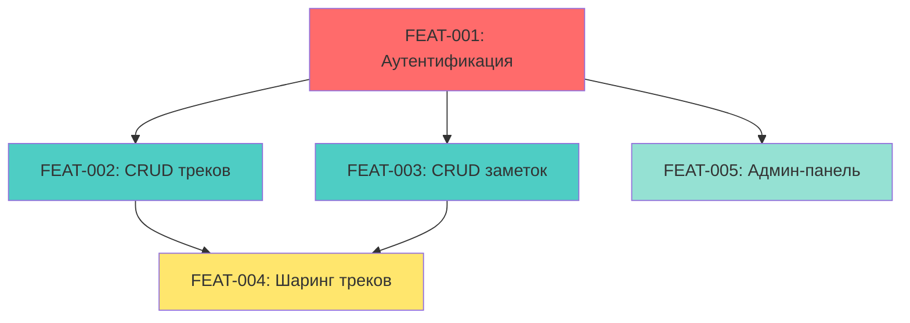
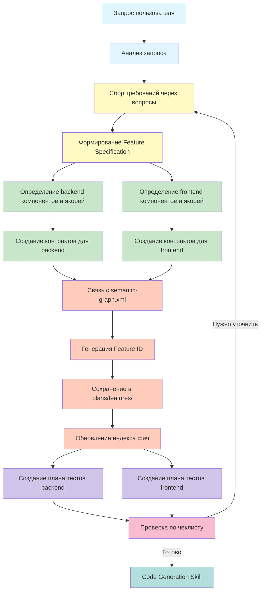

# План реализации нереализованных требований GRACE Plan

**Дата создания:** 2026-04-17  
**Источник:** `plans/нереализованные_требования_grace_plan.md`  
**Цель:** Привести ТЗ_Приложение_Треки_Развития.md в соответствие с методологией GRACE

---

## Обзор ситуации

Текущее ТЗ_Приложение_Треки_Развития.md содержит полное техническое задание, но не следует методологии GRACE для планирования фич. Выявлено **10 категорий нереализованных требований**:

| Категория | Статус | Количество требований |
|-----------|--------|----------------------|
| Feature Specification Document | ❌ НЕ РЕАЛИЗОВАНО | 10 разделов |
| Определение компонентов с якорями | ❌ НЕ РЕАЛИЗОВАНО | 13 типов компонентов |
| Связь с semantic-graph.xml | ❌ НЕ РЕАЛИЗОВАНО | 3 секции |
| План тестов (TDD-подход) | ❌ НЕ РЕАЛИЗОВАНО | 6 уровней тестов |
| Генерация Feature ID | ❌ НЕ РЕАЛИЗОВАНО | 1 формат |
| Сохранение Feature Specification Document | ❌ НЕ РЕАЛИЗОВАНО | 3 действия |
| Обновление индекса фич | ❌ НЕ РЕАЛИЗОВАНО | 2 действия |
| Контракт-первый подход | ❌ НЕ РЕАЛИЗОВАНО | 8 элементов контракта |
| Чеклист завершения планирования | ❌ НЕ РЕАЛИЗОВАНО | 17 проверок |
| Workflow планирования | ❌ НЕ РЕАЛИЗОВАНО | 8 этапов |

---

## Этап 1: Разбивка ТЗ на фичи

### 1.1 Анализ ТЗ_Приложение_Треки_Развития.md

**Цель:** Разбить монолитное ТЗ на отдельные фичи с чёткими границами.

**Предлагаемое разбиение:**

| Feature ID | Название фичи | Описание | Приоритет |
|------------|---------------|----------|-----------|
| FEAT-001 | Аутентификация и авторизация | Регистрация, вход, JWT токены, refresh токены | P0 (Критично) |
| FEAT-002 | CRUD для треков | Создание, чтение, обновление, удаление треков | P0 (Критично) |
| FEAT-003 | CRUD для заметок | Создание, чтение, обновление, удаление заметок с иерархией | P0 (Критично) |
| FEAT-004 | Система шаринга треков | Предоставление доступа другим пользователям (OWNER/EDIT/VIEW) | P1 (Важно) |
| FEAT-005 | Админ-панель | Управление пользователями, блокировка, изменение ролей | P2 (Желательно) |

### 1.2 Определение зависимостей между фичами



**Зависимости:**
- FEAT-001 (Аутентификация) — базовая фича, от которой зависят все остальные
- FEAT-002 и FEAT-003 — независимые друг от друга, но зависят от FEAT-001
- FEAT-004 (Шаринг) — зависит от FEAT-002 и FEAT-003
- FEAT-005 (Админ-панель) — зависит от FEAT-001

---

## Этап 2: Создание Feature Specification Documents

### 2.1 Шаблон Feature Specification Document

Использовать шаблон: `.kilocode/templates/feature-spec-template.md`

### 2.2 Обязательные разделы для каждой фичи

Для каждой фичи (FEAT-001 ... FEAT-005) создать документ `plans/features/FEAT-XXX.md` со следующими разделами:

1. **Метаданные**
   - ID: FEAT-XXX
   - Название
   - Версия: 1.0.0
   - Статус: planning
   - Дата создания: 2026-04-17

2. **Описание фичи**
   - Краткое описание
   - Бизнес-контекст
   - Пользовательские истории

3. **Требования**
   - Функциональные требования
   - Нефункциональные требования
   - Ограничения

4. **Архитектура**
   - Компоненты (Backend + Frontend)
   - API Эндпоинты
   - База данных

5. **Контракты**
   - Backend Контракты (с ANCHOR_ID)
   - Frontend Контракты (с ANCHOR_ID)

6. **DTO**
   - Request DTO
   - Response DTO

7. **Тестирование**
   - Level 1: Детерминированные тесты
   - Level 2: Тесты траектории
   - Level 3: Интеграционные тесты

8. **Зависимости**
   - Внешние зависимости
   - Внутренние зависимости

9. **Риски**
   - Идентификация рисков
   - Митигация

10. **Критерии приёмки (Definition of Done)**

---

## Этап 3: Определение компонентов с якорями

### 3.1 Backend компоненты для FEAT-001 (Аутентификация)

| Компонент | Путь | ANCHOR_ID |
|-----------|------|-----------|
| AuthController | `src/main/java/org/homework/controller/AuthController.java` | AUTH_CONTROLLER |
| AuthService | `src/main/java/org/homework/service/AuthService.java` | AUTH_SERVICE |
| UserRepository | `src/main/java/org/homework/repository/UserRepository.java` | USER_REPOSITORY |
| User | `src/main/java/org/homework/model/User.java` | USER_MODEL |
| AuthRequest | `src/main/java/org/homework/dto/request/AuthRequest.java` | AUTH_REQUEST |
| RegisterRequest | `src/main/java/org/homework/dto/request/RegisterRequest.java` | REGISTER_REQUEST |
| AuthResponse | `src/main/java/org/homework/dto/response/AuthResponse.java` | AUTH_RESPONSE |
| UserDto | `src/main/java/org/homework/dto/response/UserDto.java` | USER_DTO |
| JwtTokenProvider | `src/main/java/org/homework/security/JwtTokenProvider.java` | JWT_TOKEN_PROVIDER |
| JwtAuthenticationFilter | `src/main/java/org/homework/security/JwtAuthenticationFilter.java` | JWT_AUTH_FILTER |
| SecurityConfig | `src/main/java/org/homework/security/SecurityConfig.java` | SECURITY_CONFIG |
| CustomUserDetailsService | `src/main/java/org/homework/security/CustomUserDetailsService.java` | USER_DETAILS_SERVICE |

### 3.2 Backend компоненты для FEAT-002 (CRUD треков)

| Компонент | Путь | ANCHOR_ID |
|-----------|------|-----------|
| TrackController | `src/main/java/org/homework/controller/TrackController.java` | TRACK_CONTROLLER |
| TrackService | `src/main/java/org/homework/service/TrackService.java` | TRACK_SERVICE |
| TrackRepository | `src/main/java/org/homework/repository/TrackRepository.java` | TRACK_REPOSITORY |
| Track | `src/main/java/org/homework/model/Track.java` | TRACK_MODEL |
| CreateTrackRequest | `src/main/java/org/homework/dto/request/CreateTrackRequest.java` | CREATE_TRACK_REQUEST |
| UpdateTrackRequest | `src/main/java/org/homework/dto/request/UpdateTrackRequest.java` | UPDATE_TRACK_REQUEST |
| TrackDto | `src/main/java/org/homework/dto/response/TrackDto.java` | TRACK_DTO |

### 3.3 Backend компоненты для FEAT-003 (CRUD заметок)

| Компонент | Путь | ANCHOR_ID |
|-----------|------|-----------|
| NoteController | `src/main/java/org/homework/controller/NoteController.java` | NOTE_CONTROLLER |
| NoteService | `src/main/java/org/homework/service/NoteService.java` | NOTE_SERVICE |
| NoteRepository | `src/main/java/org/homework/repository/NoteRepository.java` | NOTE_REPOSITORY |
| Note | `src/main/java/org/homework/model/Note.java` | NOTE_MODEL |
| CreateNoteRequest | `src/main/java/org/homework/dto/request/CreateNoteRequest.java` | CREATE_NOTE_REQUEST |
| UpdateNoteRequest | `src/main/java/org/homework/dto/request/UpdateNoteRequest.java` | UPDATE_NOTE_REQUEST |
| NoteDto | `src/main/java/org/homework/dto/response/NoteDto.java` | NOTE_DTO |
| NoteTreeDto | `src/main/java/org/homework/dto/response/NoteTreeDto.java` | NOTE_TREE_DTO |

### 3.4 Backend компоненты для FEAT-004 (Шаринг треков)

| Компонент | Путь | ANCHOR_ID |
|-----------|------|-----------|
| PermissionController | `src/main/java/org/homework/controller/PermissionController.java` | PERMISSION_CONTROLLER |
| PermissionService | `src/main/java/org/homework/service/PermissionService.java` | PERMISSION_SERVICE |
| TrackPermissionRepository | `src/main/java/org/homework/repository/TrackPermissionRepository.java` | TRACK_PERMISSION_REPOSITORY |
| TrackPermission | `src/main/java/org/homework/model/TrackPermission.java` | TRACK_PERMISSION_MODEL |

### 3.5 Backend компоненты для FEAT-005 (Админ-панель)

| Компонент | Путь | ANCHOR_ID |
|-----------|------|-----------|
| AdminController | `src/main/java/org/homework/controller/AdminController.java` | ADMIN_CONTROLLER |
| AdminService | `src/main/java/org/homework/service/AdminService.java` | ADMIN_SERVICE |

### 3.6 Frontend компоненты для FEAT-001 (Аутентификация)

| Компонент | Путь | ANCHOR_ID |
|-----------|------|-----------|
| LoginComponent | `frontend/src/app/features/auth/login/login.component.ts` | LOGIN_COMPONENT |
| RegisterComponent | `frontend/src/app/features/auth/register/register.component.ts` | REGISTER_COMPONENT |
| AuthService | `frontend/src/app/core/services/auth.service.ts` | AUTH_SERVICE_FRONTEND |
| AuthGuard | `frontend/src/app/core/guards/auth.guard.ts` | AUTH_GUARD |
| AuthInterceptor | `frontend/src/app/core/interceptors/auth.interceptor.ts` | AUTH_INTERCEPTOR |
| UserModel | `frontend/src/app/shared/models/user.model.ts` | USER_MODEL_FRONTEND |

### 3.7 Frontend компоненты для FEAT-002 (CRUD треков)

| Компонент | Путь | ANCHOR_ID |
|-----------|------|-----------|
| DashboardComponent | `frontend/src/app/features/dashboard/dashboard.component.ts` | DASHBOARD_COMPONENT |
| TrackService | `frontend/src/app/core/services/track.service.ts` | TRACK_SERVICE_FRONTEND |
| TrackModel | `frontend/src/app/shared/models/track.model.ts` | TRACK_MODEL_FRONTEND |

### 3.8 Frontend компоненты для FEAT-003 (CRUD заметок)

| Компонент | Путь | ANCHOR_ID |
|-----------|------|-----------|
| TrackDetailComponent | `frontend/src/app/features/track-detail/track-detail.component.ts` | TRACK_DETAIL_COMPONENT |
| NoteService | `frontend/src/app/core/services/note.service.ts` | NOTE_SERVICE_FRONTEND |
| NoteModel | `frontend/src/app/shared/models/note.model.ts` | NOTE_MODEL_FRONTEND |

### 3.9 Frontend компоненты для FEAT-004 (Шаринг треков)

| Компонент | Путь | ANCHOR_ID |
|-----------|------|-----------|
| ShareDialogComponent | `frontend/src/app/features/track-detail/share-dialog.component.ts` | SHARE_DIALOG_COMPONENT |
| PermissionModel | `frontend/src/app/shared/models/permission.model.ts` | PERMISSION_MODEL_FRONTEND |

### 3.10 Frontend компоненты для FEAT-005 (Админ-панель)

| Компонент | Путь | ANCHOR_ID |
|-----------|------|-----------|
| AdminPanelComponent | `frontend/src/app/features/admin/admin-panel.component.ts` | ADMIN_PANEL_COMPONENT |
| AdminService | `frontend/src/app/core/services/admin.service.ts` | ADMIN_SERVICE_FRONTEND |
| AdminGuard | `frontend/src/app/core/guards/admin.guard.ts` | ADMIN_GUARD |

---

## Этап 4: Создание контрактов

### 4.1 Формат контракта

Каждый контракт должен содержать:

```
ANCHOR: ANCHOR_ID
PURPOSE: Одна фраза — зачем существует этот блок

@PreConditions:
- условие 1
- условие 2

@PostConditions:
- гарантия 1 при успехе
- гарантия 2 при ошибке

@Invariants:
- инвариант 1
- инвариант 2

@SideEffects:
- побочный эффект 1

@ForbiddenChanges:
- что запрещено менять без явного согласования

@AllowedRefactorZone:
- что можно безопасно переписывать
```

### 4.2 Пример контракта для AUTH_SERVICE

```
ANCHOR: AUTH_SERVICE
PURPOSE: Управление аутентификацией и авторизацией пользователей

@PreConditions:
- username: непустая строка после trim, min 3 символа
- password: непустая строка, min 8 символов
- пользователь с таким username не существует (для регистрации)

@PostConditions:
- при успехе регистрации: возвращается AuthResponse с access_token и refresh_token
- при ошибке валидации: выбрасывается ValidationException
- при ошибке дубликата: выбрасывается UserAlreadyExistsException

@Invariants:
- пароль никогда не хранится в открытом виде
- access_token имеет ограниченное время жизни
- refresh_token имеет более длительное время жизни

@SideEffects:
- создаёт запись пользователя в БД
- генерирует JWT токены
- пишет лог регистрации в audit log

@ForbiddenChanges:
- нельзя убрать проверку длины пароля (требование безопасности)
- нельзя убрать хеширование пароля (безопасность)
- нельзя возвращать пароль в ответе (безопасность)

@AllowedRefactorZone:
- можно менять алгоритм хеширования пароля
- можно вынести валидацию в отдельную функцию
- можно изменить формат логирования
```

### 4.3 Контракты для создания

Для каждого компонента из раздела 3 создать контракт по шаблону из раздела 4.1.

---

## Этап 5: Обновление .kilocode/semantic-graph.xml

### 5.1 Структура semantic-graph.xml

```xml
<?xml version="1.0" encoding="UTF-8"?>
<semantic-graph>
  <meta>
    <product>TrackHub</product>
    <version>1.0.0</version>
    <description>Веб-приложение для управления треками развития</description>
  </meta>
  
  <components>
    <!-- Backend компоненты -->
    <component id="AUTH_CONTROLLER" kind="controller" path="src/main/java/org/homework/controller/AuthController.java">
      <role>REST контроллер для аутентификации</role>
      <depends-on ref="AUTH_SERVICE"/>
      <exposes>
        <api name="register" type="endpoint">POST /api/auth/register</api>
        <api name="login" type="endpoint">POST /api/auth/login</api>
        <api name="refresh" type="endpoint">POST /api/auth/refresh</api>
      </exposes>
    </component>
    
    <!-- ... остальные компоненты ... -->
    
    <!-- Frontend компоненты -->
    <component id="LOGIN_COMPONENT" kind="component" path="frontend/src/app/features/auth/login/login.component.ts">
      <role>UI компонент для входа в систему</role>
      <depends-on ref="AUTH_SERVICE_FRONTEND"/>
      <exposes>
        <api name="displayLoginForm" type="ui">Отображение формы входа</api>
      </exposes>
    </component>
    
    <!-- ... остальные компоненты ... -->
  </components>
  
  <relationships>
    <edge id="AUTH_TO_DB" from="AUTH_SERVICE" to="USER_REPOSITORY" kind="data-access"/>
    <edge id="FRONTEND_TO_BACKEND" from="AUTH_SERVICE_FRONTEND" to="AUTH_CONTROLLER" kind="http"/>
    <!-- ... остальные связи ... -->
  </relationships>
  
  <decisions>
    <decision id="JWT_AUTH_DECISION" status="accepted">
      <rationale>Использование JWT для stateless аутентификации</rationale>
    </decision>
    <!-- ... остальные решения ... -->
  </decisions>
</semantic-graph>
```

### 5.2 Действия для обновления

1. Добавить все backend компоненты в `<components>` секцию
2. Добавить все frontend компоненты в `<components>` секцию
3. Добавить все связи в `<relationships>` секцию
4. Добавить архитектурные решения в `<decisions>` секцию
5. Убедиться, что все `id` уникальны

---

## Этап 6: Создание планов тестов

### 6.1 Backend тесты (JUnit 5 + Spring Test)

#### Level 1: Детерминированные тесты

**FEAT-001 (Аутентификация):**
- [ ] Тест 1: Проверка успешной регистрации
- [ ] Тест 2: Проверка валидации username (менее 3 символов)
- [ ] Тест 3: Проверка валидации password (менее 8 символов)
- [ ] Тест 4: Проверка дубликата username
- [ ] Тест 5: Проверка успешного входа
- [ ] Тест 6: Проверка неверного пароля
- [ ] Тест 7: Проверка генерации JWT токена
- [ ] Тест 8: Проверка refresh токена

**FEAT-002 (CRUD треков):**
- [ ] Тест 1: Проверка создания трека
- [ ] Тест 2: Проверка получения трека по ID
- [ ] Тест 3: Проверка обновления трека
- [ ] Тест 4: Проверка удаления трека
- [ ] Тест 5: Проверка получения списка треков пользователя
- [ ] Тест 6: Проверка прав доступа (OWNER)

**FEAT-003 (CRUD заметок):**
- [ ] Тест 1: Проверка создания заметки
- [ ] Тест 2: Проверка получения заметки по ID
- [ ] Тест 3: Проверка обновления заметки
- [ ] Тест 4: Проверка удаления заметки
- [ ] Тест 5: Проверка получения дерева заметок
- [ ] Тест 6: Проверка иерархии (parent-child)
- [ ] Тест 7: Проверка порядка сортировки (orderIndex)

**FEAT-004 (Шаринг треков):**
- [ ] Тест 1: Проверка предоставления доступа VIEW
- [ ] Тест 2: Проверка предоставления доступа EDIT
- [ ] Тест 3: Проверка отзыва доступа
- [ ] Тест 4: Проверка получения списка разрешений
- [ ] Тест 5: Проверка прав доступа (VIEW/EDIT)

**FEAT-005 (Админ-панель):**
- [ ] Тест 1: Проверка получения списка пользователей
- [ ] Тест 2: Проверка блокировки пользователя
- [ ] Тест 3: Проверка разблокировки пользователя
- [ ] Тест 4: Проверка изменения роли пользователя
- [ ] Тест 5: Проверка удаления пользователя

#### Level 2: Тесты траектории

**FEAT-001 (Аутентификация):**
- [ ] Тест 1: Проверка ENTRY/EXIT логов в register()
- [ ] Тест 2: Проверка BRANCH логов при валидации
- [ ] Тест 3: Проверка DECISION логов при дубликате
- [ ] Тест 4: Проверка STATE_CHANGE логов при создании пользователя
- [ ] Тест 5: Проверка ERROR логов при исключениях

**FEAT-002 (CRUD треков):**
- [ ] Тест 1: Проверка ENTRY/EXIT логов в createTrack()
- [ ] Тест 2: Проверка CHECK логов прав доступа
- [ ] Тест 3: Проверка DECISION логов при отказе
- [ ] Тест 4: Проверка STATE_CHANGE логов при обновлении

**FEAT-003 (CRUD заметок):**
- [ ] Тест 1: Проверка ENTRY/EXIT логов в createNote()
- [ ] Тест 2: Проверка BRANCH логов при иерархии
- [ ] Тест 3: Проверка STATE_CHANGE логов при перемещении

**FEAT-004 (Шаринг треков):**
- [ ] Тест 1: Проверка ENTRY/EXIT логов в grantPermission()
- [ ] Тест 2: Проверка DECISION логов при проверке прав

**FEAT-005 (Админ-панель):**
- [ ] Тест 1: Проверка ENTRY/EXIT логов в blockUser()
- [ ] Тест 2: Проверка STATE_CHANGE логов при блокировке

#### Level 3: Интеграционные тесты

**FEAT-001 (Аутентификация):**
- [ ] Тест 1: E2E сценарий регистрации и входа
- [ ] Тест 2: Интеграция с PostgreSQL (создание пользователя)
- [ ] Тест 3: Тестирование REST API (MockMvc)
- [ ] Тест 4: Тестирование Spring Security

**FEAT-002 (CRUD треков):**
- [ ] Тест 1: E2E сценарий создания и получения трека
- [ ] Тест 2: Интеграция с PostgreSQL
- [ ] Тест 3: Тестирование REST API (MockMvc)
- [ ] Тест 4: Тестирование прав доступа

**FEAT-003 (CRUD заметок):**
- [ ] Тест 1: E2E сценарий создания иерархии заметок
- [ ] Тест 2: Интеграция с PostgreSQL (WITH RECURSIVE)
- [ ] Тест 3: Тестирование REST API (MockMvc)

**FEAT-004 (Шаринг треков):**
- [ ] Тест 1: E2E сценарий шаринга трека
- [ ] Тест 2: Интеграция с PostgreSQL
- [ ] Тест 3: Тестирование REST API (MockMvc)

**FEAT-005 (Админ-панель):**
- [ ] Тест 1: E2E сценарий блокировки пользователя
- [ ] Тест 2: Интеграция с PostgreSQL
- [ ] Тест 3: Тестирование REST API (MockMvc)

### 6.2 Frontend тесты (Jasmine/Karma)

#### Level 1: Детерминированные тесты

**FEAT-001 (Аутентификация):**
- [ ] Тест 1: Проверка отображения формы входа
- [ ] Тест 2: Проверка валидации формы входа
- [ ] Тест 3: Проверка успешного входа
- [ ] Тест 4: Проверка обработки ошибок входа
- [ ] Тест 5: Проверка отображения формы регистрации
- [ ] Тест 6: Проверка валидации формы регистрации
- [ ] Тест 7: Проверка успешной регистрации
- [ ] Тест 8: Проверка обработки ошибок регистрации

**FEAT-002 (CRUD треков):**
- [ ] Тест 1: Проверка отображения списка треков
- [ ] Тест 2: Проверка создания трека
- [ ] Тест 3: Проверка редактирования трека
- [ ] Тест 4: Проверка удаления трека
- [ ] Тест 5: Проверка пагинации
- [ ] Тест 6: Проверка сортировки
- [ ] Тест 7: Проверка фильтрации

**FEAT-003 (CRUD заметок):**
- [ ] Тест 1: Проверка отображения дерева заметок
- [ ] Тест 2: Проверка создания заметки
- [ ] Тест 3: Проверка редактирования заметки
- [ ] Тест 4: Проверка удаления заметки
- [ ] Тест 5: Проверка перемещения заметки
- [ ] Тест 6: Проверка разворачивания/сворачивания

**FEAT-004 (Шаринг треков):**
- [ ] Тест 1: Проверка отображения диалога шаринга
- [ ] Тест 2: Проверка выбора пользователя
- [ ] Тест 3: Проверка выбора роли (VIEW/EDIT)
- [ ] Тест 4: Проверка предоставления доступа
- [ ] Тест 5: Проверка отзыва доступа

**FEAT-005 (Админ-панель):**
- [ ] Тест 1: Проверка отображения списка пользователей
- [ ] Тест 2: Проверка блокировки пользователя
- [ ] Тест 3: Проверка разблокировки пользователя
- [ ] Тест 4: Проверка изменения роли
- [ ] Тест 5: Проверка удаления пользователя

#### Level 2: Тесты траектории

**FEAT-001 (Аутентификация):**
- [ ] Тест 1: Проверка ENTRY/EXIT логов в LoginComponent
- [ ] Тест 2: Проверка BRANCH логов при валидации
- [ ] Тест 3: Проверка DECISION логов при ошибке

**FEAT-002 (CRUD треков):**
- [ ] Тест 1: Проверка ENTRY/EXIT логов в DashboardComponent
- [ ] Тест 2: Проверка STATE_CHANGE логов при создании трека

**FEAT-003 (CRUD заметок):**
- [ ] Тест 1: Проверка ENTRY/EXIT логов в TrackDetailComponent
- [ ] Тест 2: Проверка BRANCH логов при иерархии

**FEAT-004 (Шаринг треков):**
- [ ] Тест 1: Проверка ENTRY/EXIT логов в ShareDialogComponent

**FEAT-005 (Админ-панель):**
- [ ] Тест 1: Проверка ENTRY/EXIT логов в AdminPanelComponent

#### Level 3: Интеграционные тесты

**FEAT-001 (Аутентификация):**
- [ ] Тест 1: E2E сценарий регистрации и входа (Cypress)
- [ ] Тест 2: Интеграция с backend API

**FEAT-002 (CRUD треков):**
- [ ] Тест 1: E2E сценарий создания трека (Cypress)
- [ ] Тест 2: Интеграция с backend API

**FEAT-003 (CRUD заметок):**
- [ ] Тест 1: E2E сценарий создания иерархии заметок (Cypress)
- [ ] Тест 2: Интеграция с backend API

**FEAT-004 (Шаринг треков):**
- [ ] Тест 1: E2E сценарий шаринга трека (Cypress)
- [ ] Тест 2: Интеграция с backend API

**FEAT-005 (Админ-панель):**
- [ ] Тест 1: E2E сценарий блокировки пользователя (Cypress)
- [ ] Тест 2: Интеграция с backend API

---

## Этап 7: Обновление индекса фич

### 7.1 Обновление plans/features/README.md

```markdown
# Features

Эта директория содержит Feature Specifications для всех фич проекта.

## Список фич

| Feature ID | Название | Статус | Дата создания | Приоритет |
|------------|----------|--------|---------------|-----------|
| FEAT-001 | Аутентификация и авторизация | planning | 2026-04-17 | P0 |
| FEAT-002 | CRUD для треков | planning | 2026-04-17 | P0 |
| FEAT-003 | CRUD для заметок | planning | 2026-04-17 | P0 |
| FEAT-004 | Система шаринга треков | planning | 2026-04-17 | P1 |
| FEAT-005 | Админ-панель | planning | 2026-04-17 | P2 |

## Статистика
- Всего фич: 5
- Завершено: 0
- В работе: 0
- В планировании: 5

## Зависимости


## Приоритеты
- **P0 (Критично)**: Базовая функциональность, без которой система не работает
- **P1 (Важно)**: Важная функциональность, но не блокирующая
- **P2 (Желательно)**: Улучшения и дополнительные возможности
```

---

## Этап 8: Чеклист завершения планирования

### 8.1 Обязательные проверки для каждой фичи

- [ ] Все требования собраны через вопросы
- [ ] Feature ID сгенерирован (FEAT-XXX)
- [ ] Feature Specification Document создан в `plans/features/FEAT-XXX.md`
- [ ] Все разделы Feature Specification Document заполнены
- [ ] Статус фичи установлен в `planning`
- [ ] Все backend компоненты определены с уникальными ANCHOR_ID
- [ ] Все frontend компоненты определены с уникальными ANCHOR_ID
- [ ] Все контракты определены (с ANCHOR_ID, PURPOSE, @PreConditions, @PostConditions, @Invariants, @SideEffects, @ForbiddenChanges, @AllowedRefactorZone)
- [ ] `.kilocode/semantic-graph.xml` обновлён
- [ ] План тестов создан (backend + frontend)
- [ ] Acceptance Criteria определены
- [ ] Зависимости от других компонентов учтены
- [ ] REST API эндпоинты определены
- [ ] DTO определены
- [ ] Angular компоненты определены
- [ ] Права доступа (OWNER/EDIT/VIEW) определены
- [ ] Индекс фич `plans/features/README.md` обновлён

---

## Этап 9: Workflow планирования фичи

### 9.1 Диаграмма workflow



### 9.2 Описание этапов

1. **Запрос пользователя** — пользователь описывает, что нужно реализовать
2. **Анализ запроса** — понимание типа фичи (backend, frontend, интеграционная)
3. **Сбор требований через вопросы** — использование `ask_followup_question` для уточнения деталей
4. **Формирование Feature Specification** — создание документа по шаблону
5. **Определение backend компонентов и якорей** — список компонентов с ANCHOR_ID
6. **Определение frontend компонентов и якорей** — список компонентов с ANCHOR_ID
7. **Создание контрактов для backend** — контракты с обязательными полями
8. **Создание контрактов для frontend** — контракты с обязательными полями
9. **Связь с semantic-graph.xml** — обновление семантического графа
10. **Генерация Feature ID** — создание уникального ID (FEAT-XXX)
11. **Сохранение в plans/features/** — создание файла спецификации
12. **Обновление индекса фич** — обновление README.md
13. **Создание плана тестов backend** — Level 1, 2, 3
14. **Создание плана тестов frontend** — Level 1, 2, 3
15. **Проверка по чеклисту** — проверка всех обязательных пунктов
16. **Code Generation Skill** — переход к генерации кода

---

## Порядок выполнения

### Фаза 1: Подготовка (1-2 дня)

1. ✅ Анализировать ТЗ_Приложение_Треки_Развития.md и разбить на отдельные фичи
2. ✅ Определить приоритеты фич и сгенерировать Feature ID (FEAT-001, FEAT-002, и т.д.)
3. ✅ Обновить индекс фич в plans/features/README.md

### Фаза 2: Создание Feature Specification Documents (3-5 дней)

4. ✅ Создать Feature Specification Document для FEAT-001 (Аутентификация и авторизация)
5. ✅ Создать Feature Specification Document для FEAT-002 (CRUD для треков)
6. ✅ Создать Feature Specification Document для FEAT-003 (CRUD для заметок)
7. ✅ Создать Feature Specification Document для FEAT-004 (Система шаринга треков)
8. ✅ Создать Feature Specification Document для FEAT-005 (Админ-панель)

### Фаза 3: Определение компонентов и контрактов (2-3 дня)

9. ✅ Определить backend компоненты с уникальными ANCHOR_ID для каждой фичи
10. ✅ Определить frontend компоненты с уникальными ANCHOR_ID для каждой фичи
11. ✅ Создать контракты для всех backend компонентов
12. ✅ Создать контракты для всех frontend компонентов

### Фаза 4: Обновление архитектуры (1 день)

13. ✅ Обновить .kilocode/semantic-graph.xml с компонентами и связями

### Фаза 5: Создание планов тестов (2-3 дня)

14. ✅ Создать план тестов Level 1 (детерминированные тесты) для backend
15. ✅ Создать план тестов Level 2 (тесты траектории) для backend
16. ✅ Создать план тестов Level 3 (интеграционные тесты) для backend
17. ✅ Создать план тестов Level 1 (детерминированные тесты) для frontend
18. ✅ Создать план тестов Level 2 (тесты траектории) для frontend
19. ✅ Создать план тестов Level 3 (интеграционные тесты) для frontend

### Фаза 6: Завершение (1 день)

20. ✅ Создать чеклист завершения планирования для каждой фичи
21. ✅ Документировать workflow планирования фичи

---

## Риски и митигация

| Риск | Вероятность | Влияние | Митигация |
|------|-------------|----------|-----------|
| Недостаточно информации в ТЗ | Средняя | Высокое | Использовать `ask_followup_question` для уточнения |
| Сложность определения контрактов | Средняя | Среднее | Использовать примеры из `.kilocode/rules/semantic-code-markup.md` |
| Конфликты ANCHOR_ID | Низкая | Среднее | Использовать префиксы (AUTH_, TRACK_, NOTE_, PERMISSION_, ADMIN_) |
| Объём работы | Высокая | Среднее | Приоритизация фич (P0, P1, P2) |
| Изменение требований | Средняя | Высокое | Итеративный подход с уточнением |

---

## Критерии успеха

План считается успешно реализованным, когда:

1. ✅ Все 5 фич имеют Feature Specification Documents в `plans/features/`
2. ✅ Все компоненты определены с уникальными ANCHOR_ID
3. ✅ Все контракты созданы и соответствуют требованиям
4. ✅ `.kilocode/semantic-graph.xml` обновлён
5. ✅ Планы тестов созданы для всех уровней (Level 1, 2, 3)
6. ✅ Индекс фич `plans/features/README.md` обновлён
7. ✅ Чеклист завершения планирования создан
8. ✅ Workflow планирования документирован

---

## Следующие шаги

После завершения этого плана:

1. Перейти к **Code Generation Skill** для генерации кода
2. Использовать **Contract Validation Skill** для проверки контрактов
3. Использовать **Test Generation Skill** для генерации тестов
4. Использовать **Verification Skill** для проверки реализации

---

**Примечание:** Этот план является руководством для приведения ТЗ в соответствие с методологией GRACE. Все действия должны выполняться итеративно с возможностью уточнения и корректировки.
